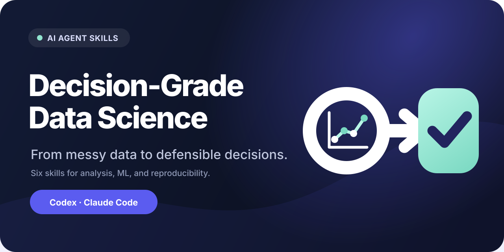

# Decision-Grade Data Science

**Open-source AI agent skills for reliable data analysis, machine learning, and AI modeling—from ambiguous questions and messy data toward validated, reproducible decisions.**

[한국어](README.ko.md) · [Methodology](docs/methodology.md) · [Evaluation](docs/evaluation.md) · [Contributing](CONTRIBUTING.md)

*From messy data to defensible decisions — [see the evidence-first methodology](docs/methodology.md).*

Decision-Grade Data Science teaches coding agents to preserve the chain from a real decision to the evidence that supports it. It is designed for work where a polished notebook or a high validation score is not enough.

## Why this exists

AI agents can write analysis code quickly. They can also silently choose the wrong row grain, treat a convenient field as ground truth, leak future information, move an evaluation target after seeing results, or declare completion after one successful run.

This suite adds a human-controlled operating discipline:

    decision contract
      → data and ground-truth audit
      → leakage-safe baseline
      → controlled experiments
      → independent validation
      → failure diagnosis
      → clean-room reproduction and handoff

The goal is not to slow work down. It is to make speed come from clear decisions, reusable evidence, and falsifiable checks instead of skipped validation.

## Skills

| Skill | Use it for |
|---|---|
| [Run Decision-Grade Data Science](skills/running-decision-grade-data-science/SKILL.md) | Orchestrate an ambiguous or end-to-end data science project |
| [Audit Data and Ground Truth](skills/auditing-data-and-ground-truth/SKILL.md) | Verify grain, joins, time semantics, missingness, labels, and source-of-truth reliability |
| [Design Leakage-Safe Experiments](skills/designing-leakage-safe-experiments/SKILL.md) | Lock prediction timing, splits, baselines, metrics, and fair comparisons |
| [Validate Models and Claims](skills/validating-models-and-claims/SKILL.md) | Determine exactly which model or analytical claims the evidence supports |
| [Diagnose ML Failures](skills/diagnosing-ml-failures/SKILL.md) | Isolate regressions across data, labels, pipelines, artifacts, metrics, and runtime |
| [Ship Reproducible Results](skills/shipping-reproducible-results/SKILL.md) | Package provenance, reproduction status, limitations, and handoff ownership |

Each skill includes focused instructions, deeper reference material, and a reusable output template. Use the end-to-end skill for a full project and the narrower skills for isolated goals.

## Install

Inspect any third-party skill before installation.

### GitHub CLI

With a GitHub CLI release that includes the gh skill public preview:

    gh skill preview aiopshwang/data-analysis-ml-agent-skills
    gh skill install aiopshwang/data-analysis-ml-agent-skills running-decision-grade-data-science --agent codex

Replace the skill name or agent host as needed. Supported hosts in the GitHub CLI include Codex, Claude Code, Cursor, GitHub Copilot, and Gemini CLI.

### Agent Skills CLI

Install all skills globally for Codex:

    npx skills add aiopshwang/data-analysis-ml-agent-skills --skill '*' --global --agent codex --copy --yes

For Claude Code, replace codex with claude-code.

### Manual installation

Clone the repository, review the selected directory, and copy it into your agent's user or project skill directory:

    git clone https://github.com/aiopshwang/data-analysis-ml-agent-skills.git

The repository also includes a Codex plugin manifest at [.codex-plugin/plugin.json](.codex-plugin/plugin.json).

## Try it

Examples:

    Use $running-decision-grade-data-science to turn this vague churn-model request into a decision-ready project.

    Use $auditing-data-and-ground-truth to inspect these tables and labels before modeling.

    Use $designing-leakage-safe-experiments to create a fair grouped and temporal evaluation.

    Use $validating-models-and-claims to check whether this report supports the launch claim.

    Use $diagnosing-ml-failures to isolate the first broken layer behind this regression.

    Use $shipping-reproducible-results to prepare an independent clean-room handoff.

Skills allow implicit discovery by default, so ordinary requests that clearly match a goal can also select them.

## Operating principles

- Fix the decision, unit of analysis, target, and time boundary before choosing a model.
- Preserve raw inputs and make derived data traceable.
- Treat ground truth as evidence to audit, not a column name to trust.
- Establish a transparent baseline before adding complexity.
- Change one material factor at a time and retain failed experiments.
- Match every claim to evidence of the same scope.
- Separate model judgment, deterministic computation, and human authority.
- Do not call partial execution, a green unit test, or one successful example complete.

Read [the methodology](docs/methodology.md) for the complete rationale and boundaries.

## What this is not

- an AutoML framework;
- a replacement for domain expertise or statistical judgment;
- a promise that every analysis needs every gate;
- permission for an agent to access private data, incur material cost, deploy, or publish;
- a guarantee of model performance, fairness, safety, or regulatory compliance.

The skills adapt depth to the decision risk and ask for human input only when a material choice cannot be safely inferred.

## Validation

The repository checks manifest and frontmatter integrity, local links, UI metadata, unfinished scaffold text, trigger-evaluation coverage, and public-content secret patterns.

    python -m pip install -r requirements-dev.txt
    python scripts/validate_repo.py
    python scripts/scan_public.py
    pytest

The [trigger prompt set](evals/trigger-prompts.yaml) contains direct, indirect, and negative cases for all seven skills. Static checks do not prove behavior; see the [v0.1.0 independent forward-test record](evals/results/v0.1.0-forward-test.md) for one realistic readiness scenario.

## Privacy and security

The public suite contains generalized procedures and synthetic templates, not customer data or copied project artifacts. Do not paste sensitive data into an agent unless the surrounding product, workspace, permissions, and retention policy are appropriate.

See [SECURITY.md](SECURITY.md) for vulnerability reporting and trust boundaries.

## aiopshwang skill family

Independent, evidence-first Agent Skills that work well together:

- [goal-to-proof](https://github.com/aiopshwang/goal-to-proof) — the general completion gate: finish authorized work and prove the requested outcome.
- [verify-regression-tests](https://github.com/aiopshwang/verify-regression-tests) — prove that a regression test actually detects its intended defect.
- [ship-mobile-app](https://github.com/aiopshwang/ship-mobile-app) — production mobile work across domain, state, lifecycle, platform, and release boundaries.

## License

[MIT](LICENSE)
